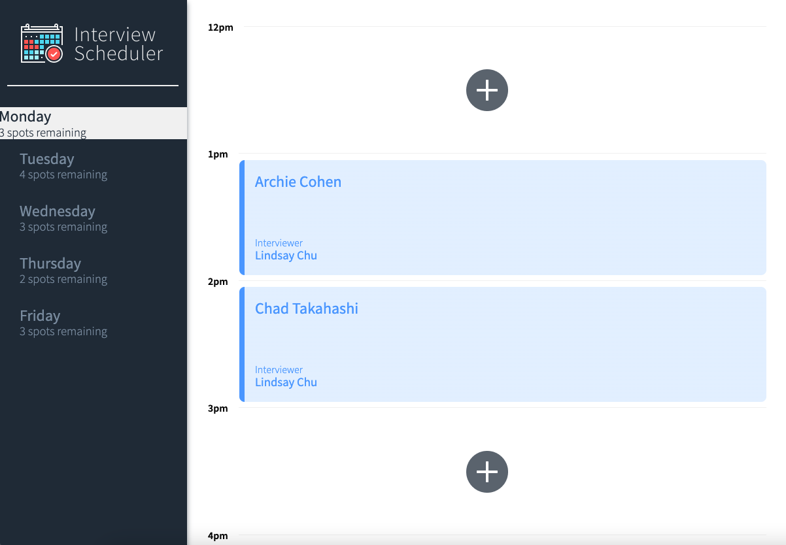
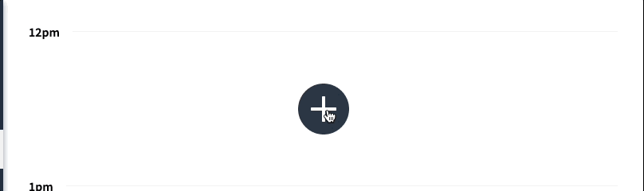
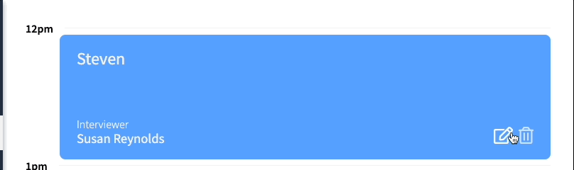
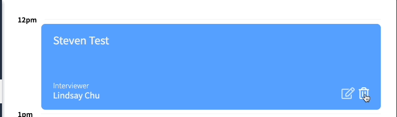

# Interview Scheduler

Interview Scheduler is a single-page application (SPA) that allows users to book interviews between students and mentors. 

Hour slots are available to be booked between 12 PM and 5 PM, Monday to Friday. Each appointment has one student and one interviewer. When creating a new appointment, the user can enter any student name while the interviewer is chosen from a predefined list. 

The user can save the appointment and view the entire schedule of appointments on any day of the week. Appointments can also be edited or deleted. 

The front end of this project is built with React and makes requests to an API to fetch and store appointment data from a database.

### Final Product

#### Booking an Appointment

#### Editing an Appointment

#### Deleting an Appointment

## Dependencies

- Axios
- Classnames
- Normalize.css
- React

## Setup

Install all dependencies with `npm install`.
Run the webpack development server with `npm start`.
